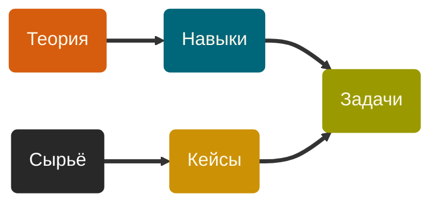

# Пошаговая инструкция придумывания задач
У вас есть абстрактные знания. И вы хотите их приземлить, «обзадачить», превратить в конкретные упражнения.

Здесь описано, как это сделать шаг за шагом. Да, не в один присест, это верно.

> [!CAUTION]
> Нет смысла придумывать одну задачу.
> 
> Только все сразу.
> 
> Иначе говоря, **создаём массив задач**.
> 
> Пусть не целиком, а порциями, но точно не поштучно.

## Чем жонглируем
Есть пять больших абстракций, представление о которых нужно держать в голове, чтобы создавать задачи эффективно.

Идти нам придётся от абстракции к абстракции: `Теория` → `Навыки` → `Сырьё` → `Кейсы` → `Задачи`.

Определения неуместны: воспринимайте смысл этих слов на свой вкус. И разбирайтесь по ходу (подсказки будут).

## Теория
`1` • [Усвоить теорию](<steps/1 • Усвоить теорию.md>). Проработать книгу или статью, законспектировать лекцию. Иногда — написать и упорядочить теорию самостоятельно. «Загрузить» в себя связное знание и зафиксировать его на бумаге.

`2` • [Вписать теорию в реальность](<steps/2 • Вписать теорию в реальность.md>). Особенно тщательно зафиксировать ответы на вопросы «Зачем это всё знать и изучать?» и «В какой контекст вписывается эта информация?». Придумать примеры. Структура и аннотации автора теории тут могут и не особо помогать.

`3` • [Разметить точки прокачки](<steps/3 • Разметить точки прокачки.md>). Места в теории, требующие поддержки задачами. Иначе говоря, точки, где у пользователя теории возникают трудности в освоении. И пример не помогает. Таким образом поток задач становится чем-то вроде интеллектуального helpdesk’а или support’а — службы, которая помогает разобраться в ситуации и всё наладить (в голове и в руках).

## Навыки
`4` • [Точечно зафиксировать навыки](<steps/4 • Точечно зафиксировать навыки.md>). Записать, что именно должны прорабатывать задачи в точках прокачки. Какие именно навыки.

`5` • [Понять, зачем тут навык](<steps/5 • Понять, зачем тут навык.md>). Зафиксировать, зачем прорабатывать этот конкретный навык в каждой точке. Попутно понять контекст этого навыка: он нам нужен для того, чтобы понять что-то дальше? Или это прикладной навык, полезный в работе? А может, общая эрудиция? А может, вообще что-то общефилософское или soft?

`6` • [Типизировать задачи](<steps/6 • Типизировать задачи.md>). Решить, какого типа задачи должны быть в точке прокачки, чтобы проработать навык. А какого типа задачи вообще бывают, кстати?

## Сырьё
`7` • [Придумать сырьё](<steps/7 • Придумать сырьё.md>). Для каждой задачи придумать, из какого сырья будем её создавать. Какие куски «реального мира» нужно «добыть», чтобы на их основе создать задачу.

`8` • [Классифицировать сырьё](<steps/8 • Классифицировать сырьё.md>). Или, что то же, классифицировать задачи по типу необходимого сырья. Сырьё редко ищут под одну задачу, чаще под класс.

`9` • [Собрать сырьё](<steps/9 • Собрать сырьё.md>). Для каждого класса задач. Приводить в порядок не нужно, тут главное — много однородного сырья.

`10` • [Раскидать сырьё](<steps/10 • Раскидать сырьё.md>). Распределить запас сырья по конкретным задачам. «Мы тут сделаем это, а тут это». Этот шаг позволит управлять сложностью задачи и чуть точней структурировать класс задач.

## Кейсы
`11` • [Придумать ответ и решение задачи](<steps/11 • Придумать ответ и решение задачи.md>). Да-да, задачи ещё нет, но мы её решаем. Лучше назвать это созданием микрокейса из сырья. А уж из микрокейса сделаем задачу — терпение 🙂

`12` • [Разбить решение на шаги](<steps/12 • Разбить решение на шаги.md>). Обычно придумать в голове — это быстро и со срезанием углов. Но когда начинаешь фиксировать, вылезают неочевидные для начинающих шаги. Они-то нам и нужны.

`13` • [Добавить пробелы](<steps/13 • Добавить пробелы.md>). Убрать из решения ходы, которые студент должен будет сделать сам для освоения навыка. Так мы получим обвязку задачи: вот уже почти всё сделано, но тут давай сам_а.

## Задачи
`14` • [Дидактизировать задачу](<steps/14 • Дидактизировать задачу.md>). Явным образом сформулировать, что дано, что что хотим получить, что и зачем для этого нужно сделать.

`15` • [Снизить напряг](<steps/15 • Снизить напряг.md>). Записать подсказки и — на основе микрокейса — разбор.
